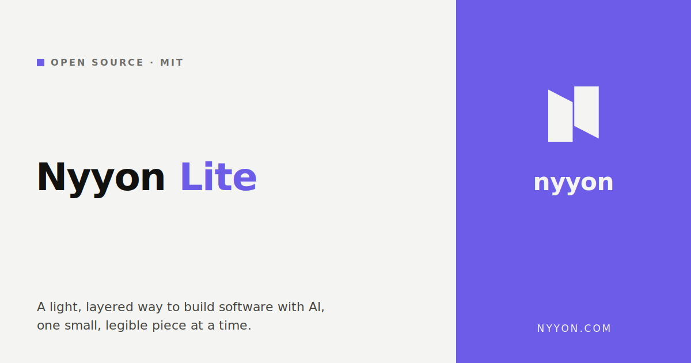
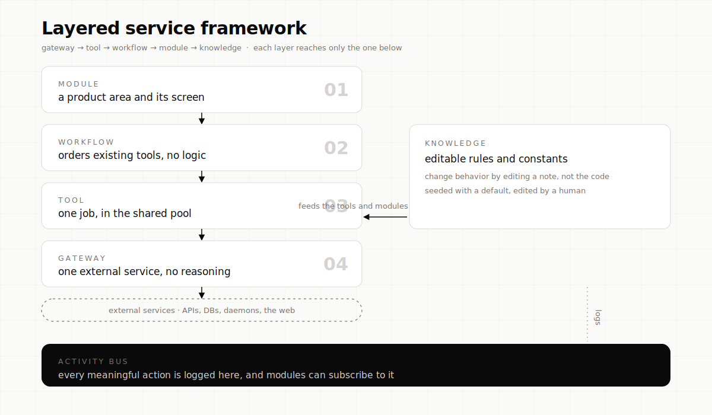
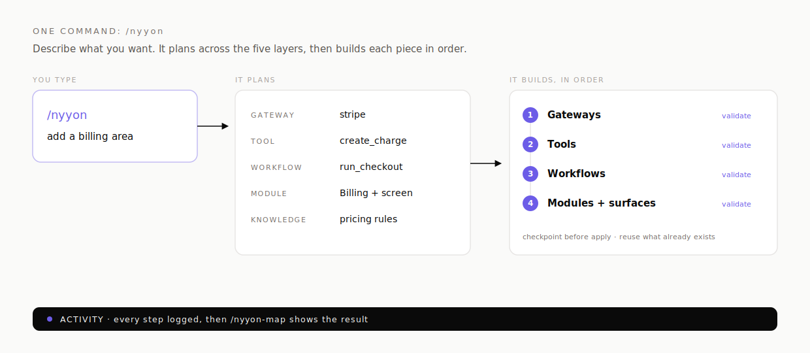
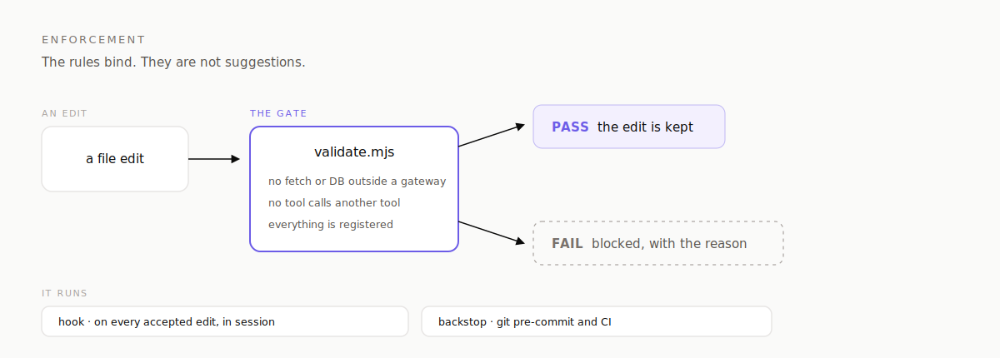

# Nyyon Lite



An installable agent **skill**: a methodology + copy-paste templates for building and
extending a system in five layers.



Each layer reaches only the layer(s) below it. Everything is JSON in / JSON out. Every
meaningful mutation logs to an activity bus. Behavior lives in editable knowledge, not code.

## Why this exists

AI builds best in small pieces. A language model can't hold a whole codebase in its head
at once. Ask it to build a big app in one shot and you get something that works for a
moment but that nobody, human or AI, can safely change later.

This framework fixes that by cutting every build into small, self-contained parts with
fixed edges:

- a **gateway** talks to one outside service
- a **tool** does one job
- a **workflow** runs a few tools in order
- a **module** is one feature with its own screen
- **knowledge** holds the rules, in plain words you can edit

Each part is small enough to build and test on its own. Each part only needs to know about
the parts directly beneath it, never the whole system. So the model can zoom in on one
piece, finish it, prove it works, and move on, without ever loading the entire codebase.

The payoff is a system that stays readable no matter how many times it's edited. You can
follow the chain of gateways, tools, workflows and modules and actually see how the thing
works. It's a little more structure than a seasoned developer needs on their own, and
that's the point: it's built for building **with** AI, where staying legible across a
hundred small edits matters more than being clever in one.

In short: small pieces, fixed edges, one at a time. Boring on purpose, so it never turns
into a mess.

## How a request flows


## One command: /nyyon

You do not have to drive the five layers by hand. Type `/nyyon <what you want>` and the model
does the whole thing: it reads what already exists, plans the build across all five layers in
strict dependency order (gateways, then tools, then workflows, then modules and surfaces, with
knowledge notes wherever a rule would otherwise be hardcoded), shows you that plan for a quick
yes, then builds it piece by piece, registering and validating each part before moving to the
next. It reuses whatever is already there instead of rebuilding it.

```
/nyyon add a billing area to the app
```



## See the live system: /nyyon-map

`/nyyon-map` draws the current system from the actual registries: every gateway, tool, workflow,
module and page, and how they connect. It is the fastest way to see what you already have before
you build more.

The rest of the utility set, all read-only: `/nyyon-doctor` checks the system for wiring problems
and dangling references and tells you what to fix, `/nyyon-review` reads a change against the
guardrails and flags any layer violation before you commit it, `/nyyon-test <tool|gateway>`
exercises one component against outcomes you describe and shows where it aligns and where it does
not, and `/nyyon-unbuild <layer> <name>` cleanly removes a component and every registration of it.

## What's here

- **`SKILL.md`**: the skill. When to use it, the model, a "which layer do I need" decision
  table, a build recipe per layer, the guardrails, anti-patterns, and a review checklist.
- **`templates/`**: a copy-paste skeleton per component: `gateway.js`, `tool.js`,
  `workflow.js`, `module.index.js`, `module.page.jsx`, `migration.sql`.
- **`commands/`**: one slash command per layer: `/nyyon-gateways`, `/nyyon-tools`,
  `/nyyon-workflows`, `/nyyon-modules`, `/nyyon-knowledge`, plus `/nyyon-surfaces` to add a
  page/view to an existing module. Each runs that layer's recipe, registers the result, and
  validates.
- **more commands**: `/nyyon` plans and builds a whole capability across the layers; `/nyyon-map`,
  `/nyyon-doctor`, `/nyyon-review`, `/nyyon-test`, `/nyyon-unbuild` map, health-check, review,
  behaviour-test, and cleanly remove.
- **`scripts/validate.mjs`, `hooks/`, `.claude-plugin/`, `agents/`**: the layer validator, the
  edit-time enforcement hook, the plugin manifests, and the reviewer subagent (see Enforcement and
  Install as a plugin below).


## Enforcement

The layer rule ("reach only the layer below, never sideways, never up") is not a suggestion. It is
checked by `scripts/validate.mjs`: a universal, zero-dependency Node script that every `/nyyon-*`
build command runs before it claims done. It fails on a raw `fetch` or DB call outside a gateway, a
tool importing another tool, and any component that is not registered in its layer's index. Because
it is plain text and regex based, it works on any host language with no install.

On JavaScript and TypeScript hosts you can add the optional `.dependency-cruiser.cjs` config for an
AST-accurate second opinion plus a visual dependency graph, useful in CI or an audit.

For real-time feedback there is a Claude Code hook: it runs the validator on every accepted edit
(`PostToolUse` matching `Edit|Write`) and feeds any violation straight back to the model so it
self-corrects on the next turn. A git pre-commit hook or CI step running the same validator is the
backstop, so nothing that breaks a layer rule reaches the main branch.



## Install (on any Claude Code / agent)

One command. It installs the skill into `~/.claude/skills/nyyon-lite` and links the
`/nyyon-*` commands. Re-run it any time to update:

```bash
curl -fsSL https://raw.githubusercontent.com/LevNyyon/nyyon-lite/main/install.sh | bash
```

Prefer to see what runs first? Do the same by hand:

```bash
git clone https://github.com/LevNyyon/nyyon-lite.git ~/.claude/skills/nyyon-lite
mkdir -p ~/.claude/commands
ln -sf ~/.claude/skills/nyyon-lite/commands/*.md ~/.claude/commands/
```

The skill auto-triggers on build / extend / wire-a-service / review tasks via its
description; the commands are typed explicitly (`/nyyon-tools summarize`). For a
per-project install, set `NYYON_LITE_DIR=.claude/skills/nyyon-lite` and
`NYYON_LITE_CMDDIR=.claude/commands` before the one-liner.

## Install as a plugin

nyyon-lite is also a Claude Code plugin, and its own single-plugin marketplace. Add the
marketplace, then install:

```
/plugin marketplace add LevNyyon/nyyon-lite
/plugin install nyyon-lite@nyyon-lite
```

Plugin commands are namespaced, so you get `/nyyon-lite:nyyon-tools` and friends. The `curl | bash`
one-liner and the manual `git clone` install both still work exactly as before, and those give you
the bare `/nyyon-tools` command names.

## Use it

Ask the agent to add a capability. It will: pick the right layer, copy the matching
template, follow the recipe, register the component, check it against the guardrails, and
log the action. Ask it to review, and it walks the checklist and reports violations with
file:line + fix.

## Not a runnable app

nyyon-lite is a pattern kit and an agent skill, not a standalone application. There is no server to
start and nothing to deploy. You drop it into a host app you are building or extending, and it gives
the model the five-layer methodology, the copy-paste templates, the slash commands, and the
validator that keep that host app legible as it grows. The thing that runs is your app, built the
nyyon-lite way.
